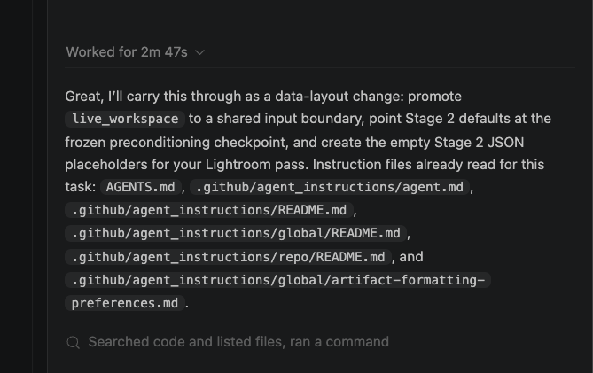
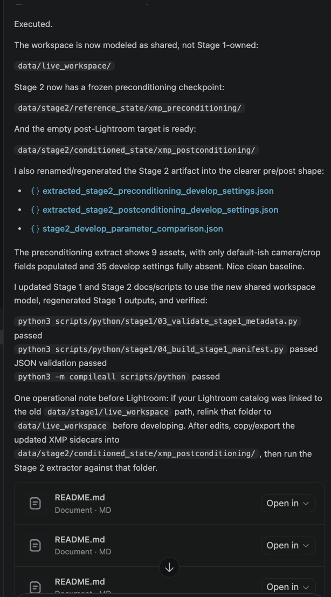
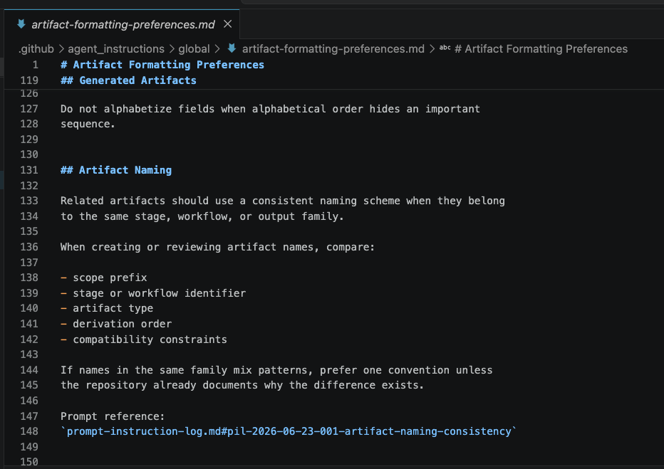
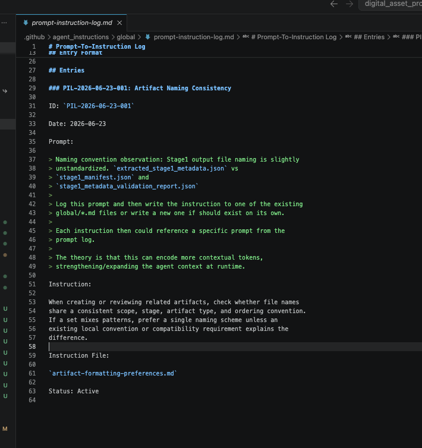
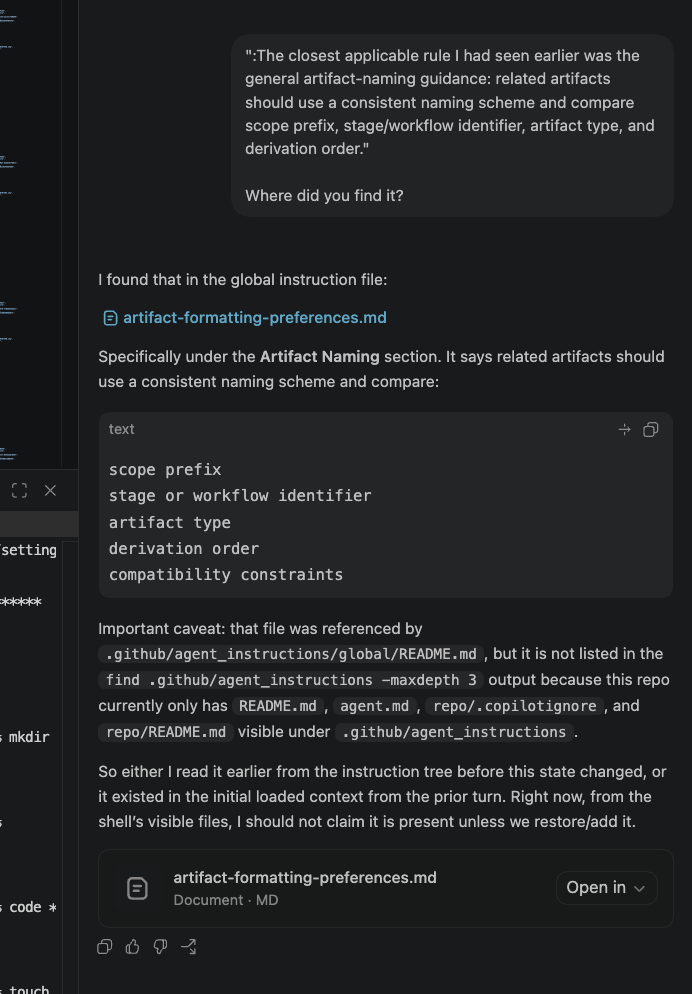

# Agent Instruction-Output Alignment Gap

## Summary

During a Stage 2 data-layout change, an AI coding agent reported loading
repository artifact-naming guidance, executed the requested change, and
passed ordinary technical validation. The generated output filenames
still violated the intended namespace convention for Stage 2 artifacts.

The issue was low severity in this repository, but it demonstrates a
governance failure mode relevant to higher-stakes AI-assisted
engineering workflows: agent self-reporting is not sufficient evidence
of instruction compliance.


## Context

The governing instruction came from the repository's loaded global
agent-instruction layer. The operative artifact-naming guidance said
related artifacts should use a consistent naming scheme and compare:

```text
scope prefix
stage or workflow identifier
artifact type
derivation order
compatibility constraints
```

The prompt provenance for that reusable rule was recorded as
`PIL-2026-06-23-001: Artifact Naming Consistency`.


## Evidence



*Figure 1: The agent reported loading the repository instruction tree,
including artifact-formatting guidance, before executing the Stage 2
data-layout change.*



*Figure 2: The completed change reported passing validation while
showing a mixed Stage 2 output naming pattern.*



*Figure 3: The artifact-naming instruction states that related artifacts
should use a consistent naming scheme across scope, stage, artifact
type, derivation order, and compatibility constraints.*



*Figure 4: The prompt-to-instruction log records the earlier naming
consistency observation that produced the reusable artifact-naming
instruction.*



*Figure 5: The follow-up exchange traces the rule back to the loaded
artifact-formatting guidance and exposes the gap between reported
instruction context and executed output.*


## Observed Gap

The agent reported reading the relevant instruction file, then created
the following Stage 2 outputs:

```text
outputs/stage2/extracted_stage2_preconditioning_develop_settings.json
outputs/stage2/extracted_stage2_postconditioning_develop_settings.json
outputs/stage2/stage2_develop_parameter_comparison.json
```

These names passed normal file, JSON, and script checks, but the naming
set mixed namespace order. Two artifacts placed the operation
(`extracted`) before the stage namespace (`stage2`), while the comparison
artifact used `stage2` as the first token.


## Expected Convention

Stage-scoped output artifacts should share a common namespace prefix so
the output directory sorts and reads as one conceptual family:

```text
outputs/stage2/stage2_extracted_preconditioning_develop_settings.json
outputs/stage2/stage2_extracted_postconditioning_develop_settings.json
outputs/stage2/stage2_develop_parameter_comparison.json
```


## Why It Matters

This example is intentionally small. The artifact names did not affect
runtime behavior, data privacy, or the validity of the Stage 2
preconditioning extract.

The larger lesson is that an agent can:

- report that it loaded governing instructions
- perform a requested repository change
- pass syntax, JSON, and compile checks
- still produce an output that conflicts with the intent of the loaded
  instruction

In a higher-stakes setting, the same pattern could appear as a privacy
boundary, validation, schema, or safety-control gap.


## Remediation

The Stage 2 outputs were renamed to the common `stage2_` namespace
prefix, and internal references were updated:

```text
outputs/stage2/stage2_extracted_preconditioning_develop_settings.json
outputs/stage2/stage2_extracted_postconditioning_develop_settings.json
outputs/stage2/stage2_develop_parameter_comparison.json
```

This case should later be summarized in a dedicated public AI agent
governance repository alongside other examples of instruction-following
drift, stale-context risk, validation blind spots, and
claim-to-execution mismatch.


## Control Lesson

Validation should include convention checks, not only syntax,
compilation, JSON validity, and script execution. For AI-assisted
engineering, a useful control should compare the agent's reported
instruction context against the concrete artifacts it produced.
